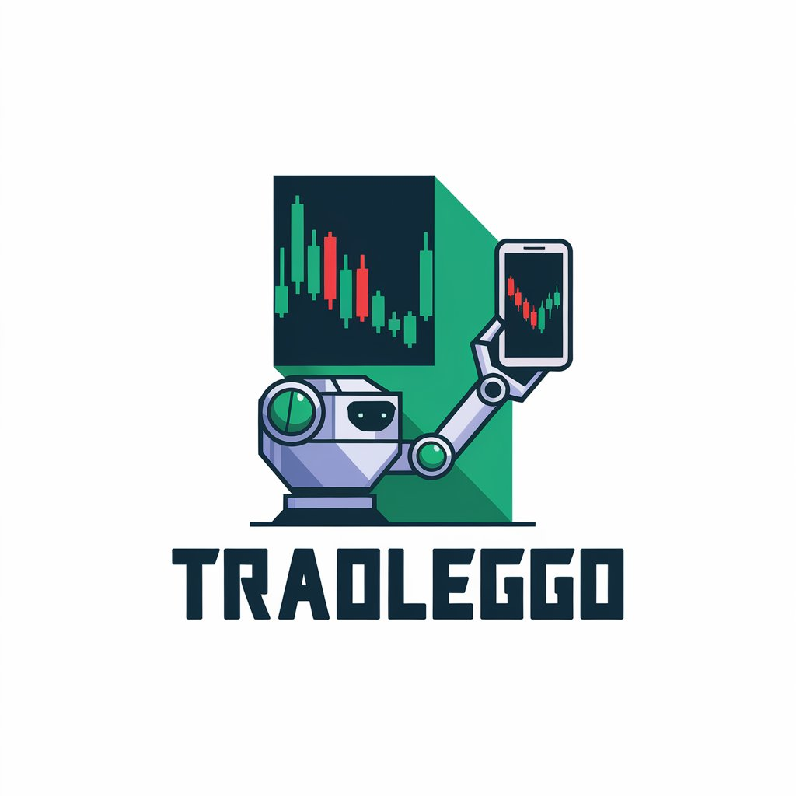

# trad-leggo

It is a one-spot platform to do algo trading on your local machine, compatible with various trading api
# my app in a few words 
It's more dashboard where you add your own model to trade on your own on your local machine with decent high-speed internet
and execution of trade cheap but market feed is expensive so in this it more of like back testing dashboard
# trading and data api 
Since we are running on a tight budget so we have to use free APIs for market data feed and trade execution
1. dhanhq api for trade execution
2. upstox ticktak api for market feed or nse api
# GUI toolkits
1. DASH based on Flask
2. ploty for graphs
3. html, css for ui/ux

